# Syncboard &bull; Enterprise Project, Kanban & Live Telemetry Management

[](https://www.php.net/)
[](https://getbootstrap.com/)
[](https://jquery.com/)
[](#)

**Syncboard** adalah platform manajemen proyek, alur kerja Kanban terpadu, dokumentasi rekayasa perangkat lunak, dan pemantauan telemetri infrastruktur produksi (*Live Infrastructure & Telemetry Monitoring*) yang dirancang untuk skala enterprise. Platform ini memadukan eksekusi tugas tim (*Team Workspaces*), tata kelola akses master (*Master Governance*), visibilitas roadmap (*Master Timeline & Calendar*), dokumentasi teknis (*Engineering Hub*), hingga monitoring metrik server dan database secara real-time.

---

## 📑 Daftar Isi
1. [Fitur Utama](#-fitur-utama)
2. [Rancangan & Arsitektur Sistem](#-rancangan--arsitektur-sistem)
3. [Fitur Unggulan: Unified Layout & Splash Screen Loader](#-fitur-unggulan-unified-layout--splash-screen-loader)
4. [Skema & Alur Kerja Navigasi](#-skema--alur-kerja-navigasi)
5. [Struktur Direktori Proyek](#-struktur-direktori-proyek)
6. [Teknologi yang Digunakan](#-teknologi-yang-digunakan)
7. [Panduan Instalasi & Menjalankan](#-panduan-instalasi--menjalankan)

---

## 🚀 Fitur Utama

Syncboard dibagi ke dalam 4 modul ekosistem utama yang dapat diakses melalui bilah navigasi rel (*Side Rail Navigation*):

```mermaid
graph TD
    A[Syncboard Navigation Rail] --> B[1. Master Suite]
    A --> C[2. Workspace Suite]
    A --> D[3. Monitoring Suite]
    A --> E[4. Setting Suite]

    B --> B1[User & Access Control]
    B --> B2[Role & Permissions Matrix]
    
    C --> C1[Multi-Project Kanban Boards]
    C --> C2[Master Calendar & Gantt Timeline]
    C --> C3[Documentations: BRD, FSD, ERD, PRD, Blueprints]
    C --> C4[Documents Version Tracking & History]
    C --> C5[Team Capacity & Workload]

    D --> D1[Live Server Specs & Telemetry]
    D --> D2[Production Database & Tables]
    D --> D3[Domain & SSL Certificate Health]
    D --> D4[Network Traffic & Status Codes]

    E --> E1[Workspace Branding & General]
    E --> E2[Kanban Stages & Priority SLAs]
    E --> E3[Notification Webhooks: Slack, Discord, SMTP]
    E --> E4[API Keys & Git/Figma Integrations]
    E --> E5[Account Profile & 2FA Security]
```



### 1. Workspace Suite (`/Workspace`)
- **Master Project Portfolio (`KanbanProject.php`)**: Dashboard ringkasan portofolio, Master Kanban Board (Drag & Drop), Tabel Master Project List, kalender jadwal proyek, dan interactive timeline scheduler.
- **Interactive Task Board (`KanbanTask.php`)**: Papan kanban task per proyek (*Company Website, Middleware Project, Landing Page Campaign*), checklist subtasks, activity log/comments stream, dan modal task manager.
- **Master Calendar & Gantt Timeline (`CalendarTimeline.php`)**:
  - **Master Calendar Tab**: Jadwal deadline task lintas proyek secara bulanan.
  - **Master Timeline Tab**: Roadmap horizontal Gantt chart dengan pelacakan progres milestone & timeline proyek.
  - **Timeline & Milestone Config Tab**: Konfigurasi fase milestone, tanggal kick-off, batas waktu go-live, dan aturan dependensi jadwal per project.
- **Engineering Documentation Hub (`/Workspace/Documentation`)**:
  - **BRD (Business Requirements Document)**: Pelacakan dokumen kebutuhan bisnis dengan modal review/approval.
  - **FSD (Functional Specification Document)**: Spesifikasi fungsional modul, arsitektur, dan use-case flow.
  - **PRD (Product Requirements Document)**: Dokumentasi target produk, KPI, dan acceptance criteria.
  - **ERD (Entity Relationship Diagram)**: Skema relasi basis data dan kamus data.
  - **Blueprints & Architecture Maps**: Diagram arsitektur sistem, topologi cloud, dan microservices.
  - **Tracking Version Hub (`TrackingVersion.php`)**: Pelacakan riwayat versi dokumen, branch, changelog, dan rollback versioning.
- **Team Management (`Teams.php`)**: Direktori tim, peran anggota, keahlian, dan distribusi beban kerja (*workload capacity*).

### 2. Live Monitoring & Telemetry (`/Monitoring`)
- **Dashboard Overview (`dashboard.php`)**: Metrik utilisasi agregat (Traffic 2.4M req/day, CPU 32.4%, RAM 18.4 GB, Storage NVMe 412 GB).
- **Server Specs Matrix (`servers.php`)**: Daftar spesifikasi hardware server, vCPU, memory, OS distro (Ubuntu / Rocky Linux), dan status node klaster.
- **Network Traffic & Latency (`traffic.php`)**: Pemantauan response time, volume request, dan distribusi HTTP status code (*2xx, 4xx, 5xx*).
- **Production Database Inspector (`database.php`)**: Inventori tabel database produksi riil (`tbl_middleware_logs`, `tbl_telemetry_events`, `tbl_landing_leads`, `tbl_mobile_sync_tokens`, dll.), jumlah baris (*row counts*), ukuran data, ukuran indeks, dan tipe mesin penyimpanan (*InnoDB / TimescaleDB*).
- **Domains & SSL Registry (`domains.php`)**: Pemantauan FQDN domain, resolver DNS/Cloudflare, countdown masa berlaku sertifikat SSL (Let's Encrypt / DigiCert), serta kesiapan TLS 1.3 & HTTP/3.

### 3. Master Access & Governance (`/Master`)
- **Master Dashboard (`dashboard.php`)**: KPI ringkasan akun aktif, statistik verifikasi, dan audit log.
- **User Management (`users.php`)**: Pengelolaan akun pengguna, status aktivasi, reset kredensial, dan assignment ke proyek.
- **Role & Permission Management (`role.php`, `permission.php`)**: Pengaturan Role-Based Access Control (RBAC) dengan granularitas permission tingkat modul.

### 4. Master Setting & Ecosystem (`/Setting`)
- **Personal Account (`account.php`)**: Profil pengguna, avatar, kredensial login, email, dan integrasi Single Sign-On (SSO).
- **Account Security (`account-security.php`)**: Setup Two-Factor Authentication (2FA QR Code), session device manager, dan password security.
- **Workspace & Branding (`general.php`)**: Nama workspace, URL slug, logo/avatar perusahaan, standar timezone (Asia/Jakarta), format penomoran Task (`SYNC-XXX`), dan auto-archive rules.
- **Kanban Stages & Workflow (`kanban.php`)**: Kustomisasi kolom tahapan (*To Do, In Progress, QA Review, Done*), batasan WIP (Work In Progress), level prioritas, dan label tag global.
- **Notification Channels (`notifications.php`)**: Webhook Slack, Discord, Telegram bot, dan konfigurasi SMTP Email.
- **Integrations & API Keys (`integrations.php`)**: Integrasi repository GitHub / GitLab, Figma embeds, cloud storage, dan generator REST API Token.
- **Security & Compliance (`security.php`)**: Penegakan 2FA global, Session Inactivity Timeout, dan masa retensi data audit.

---

## 🎨 Fitur Unggulan: Unified Layout & Splash Screen Loader

Syncboard telah dimigrasikan ke arsitektur **Unified Master Layout** terpusat:

```
+-----------------------------------------------------------------------------------+
|                            layouts/header.php                                     |
|  - HTML Head, Google Fonts, Bootstrap 5, FontAwesome 6, custom CSS               |
|  - Splash Screen Curtain Loader (Split-Doors Animation + SDN Logo)                |
|  - sidebar-rail (Icon Rail) & sidebar (Panel Modul Dinamis)                       |
|  - Top Navbar & Breadcrumbs Header                                                |
+-----------------------------------------------------------------------------------+
|                            PAGE CONTENT (Main Body)                               |
|  - Menggunakan konten murni tanpa duplikasi shell HTML / container ganda          |
+-----------------------------------------------------------------------------------+
|                            layouts/footer.php                                     |
|  - Penutup </main> dan </div> app-container                                       |
|  - Script Core: jQuery 3.7.1, Bootstrap 5 JS, app.js, splash_screen.js            |
|  - Script Tracker: doc-tracker.js & Modul Extra JS ($extraJs)                     |
+-----------------------------------------------------------------------------------+
```

### Karakteristik Splash Screen (`splash_screen.js`):
1. **Konfigurasi Variabel Kapital Terpusat**:
   - `SPLASH_DURATION = 800;` (Jaminan waktu tampil minimal agar transisi terlihat elegan)
   - `SPLASH_MAX_TIMEOUT = 2000;` (Batas waktu maksimum fallback)
   - `SPLASH_FADEOUT_DELAY = 850;` (Durasi tunggu animasi CSS tirai membuka penuh)
   - `SPLASH_TRANSITION_DELAY = 280;` (Animasi tirai menutup saat klik menu navigasi)
2. **Animasi Split-Curtain**: Tirai kiri dan kanan membuka secara halus ke samping (`translateX(-100%)` / `translateX(100%)`) saat status DOM `ready`/`load` tercapai.
3. **SDN Brand Identity**: Dilengkapi logo resmi `assets/img/sdn.png` dengan animasi pulse halus dan progress loading bar gradien biru.

---

## 📂 Struktur Direktori Proyek

```text
SDN_MockupProjectKanban/
├── assets/
│   ├── css/
│   │   └── styles.css              # Custom styling, design tokens, badges & animations
│   ├── img/
│   │   ├── sdn.png                 # Logo resmi Syncboard / SDN
│   │   └── mockup to do project list team.webp
│   └── js/
│       ├── app.js                  # Application Core Script
│       ├── splash_screen.js        # Splash Screen & Curtain Slide Animation Controller (jQuery)
│       ├── kanban-project.js       # Master Kanban Project & Timeline Controller
│       ├── calendar-timeline.js    # Master Calendar & Gantt Timeline Controller
│       └── doc-tracker.js          # Documentation Hub & Version Tracking Engine
├── layouts/                        # Unified Layout Architecture
│   ├── header.php                  # Centralized HTML Head, Splash Screen & Navbars
│   ├── footer.php                  # Centralized HTML Footer, Script Injections & Closing Tags
│   ├── sidebar.php                 # Dynamic Module-Aware Sidebar Navigation
│   └── navbar.php                  # Top Navigation Bar & User Profile Dropdown
├── Master/                         # Modul Tata Kelola Pengguna & Akses (RBAC)
│   ├── dashboard.php               # Overview pengguna & metrik akses
│   ├── users.php                   # Master data user akun
│   ├── role.php                    # Master roles (Admin, Developer, QA, dll.)
│   └── permission.php              # Matrix permission hak akses
├── Monitoring/                     # Modul Live Telemetry & Infrastruktur
│   ├── dashboard.php               # Live telemetry & KPI overview
│   ├── servers.php                 # Hardware node specs & server metrics
│   ├── traffic.php                 # Network traffic & HTTP response analytics
│   ├── database.php                # Production database & table size inventory
│   └── domains.php                 # FQDN domain & SSL certificate registry
├── Setting/                        # Modul Master Pengaturan Aplikasi
│   ├── account.php                 # Personal profile, avatar & account preferences
│   ├── account-security.php        # 2FA QR Code setup, active sessions & password
│   ├── general.php                 # Workspace branding, timezone & defaults
│   ├── kanban.php                  # Master kanban stages, WIP limits & priorities
│   ├── notifications.php           # Notification channels (Slack, Discord, SMTP)
│   ├── integrations.php            # Git auto-sync, Figma embeds, REST API keys
│   └── security.php                # Security governance, 2FA policy & audit logs
├── Workspace/                      # Modul Ruang Kerja Tim & Proyek
│   ├── KanbanProject.php           # Master Project portfolio & directory (Dashboard, Board & List)
│   ├── KanbanTask.php              # Interactive Task Kanban Board per project
│   ├── CalendarTimeline.php        # Master Calendar, Gantt Timeline & Milestone Config
│   ├── dashboard.php               # Workspace analytics & project completion stats
│   ├── Teams.php                   # Direktori anggota tim & alokasi beban kerja
│   ├── Setting.php                 # Project-level quick settings
│   └── Documentation/              # Engineering Documentation Hub
│       ├── BRD.php                 # Business Requirements Document
│       ├── FSD.php                 # Functional Specification Document
│       ├── PRD.php                 # Product Requirements Document
│       ├── ERD.php                 # Database Schema & Entity Relationship Diagram
│       ├── Blueprints.php          # Architecture & Infrastructure Blueprints
│       └── TrackingVersion.php     # Documents Tracking Version & Revision History Hub
├── index.php                       # Application entry point (Redirect ke Workspace)
├── vercel.json                     # Konfigurasi deployment Vercel
└── README.md                       # Dokumentasi lengkap proyek
```

---

## 🛠 Teknologi yang Digunakan

- **Backend / Scripting Engine**: PHP 8.x
- **Frontend Framework**: [Bootstrap 5.3.2](https://getbootstrap.com/)
- **Iconography**: [FontAwesome 6.4.0 Pro/Free](https://fontawesome.com/) & [Bootstrap Icons](https://icons.getbootstrap.com/)
- **Typography**: [Google Fonts (Plus Jakarta Sans & JetBrains Mono)](https://fonts.google.com/specimen/Plus+Jakarta+Sans)
- **DOM & Interactions**: [jQuery 3.7.1](https://jquery.com/)
- **Styling Architecture**: Custom CSS Design System with CSS Custom Properties / Variables

---

## 💻 Panduan Instalasi & Menjalankan

### Persyaratan Lingkungan:
- Web Server lokal: **Apache / Nginx** (misal: XAMPP, Laragon, atau Valet)
- **PHP 8.0** atau versi yang lebih tinggi

### Langkah-Langkah Menjalankan:
1. **Clone Repository**:
   ```bash
   git clone https://github.com/irsjrhr/MOCKUP_KANBAN_PROJECT.git
   ```
2. Pindahkan folder proyek ke direktori root web server Anda:
   - **XAMPP**: `C:/xampp/htdocs/MOCKUP_KANBAN_PROJECT`
   - **Laragon**: `C:/laragon/www/MOCKUP_KANBAN_PROJECT`
3. Pastikan modul **Apache** pada web server telah berjalan aktif.
4. Buka browser web dan akses:
   ```url
   http://localhost/MOCKUP_KANBAN_PROJECT/
   ```
5. Aplikasi akan otomatis memunculkan animasi splash screen tirai dan membuka halaman utama **Workspace Kanban Project**.

---

## 🔒 Standar Kode & Konvensi
- Mengikuti pendekatan hierarki terpusat (*Centralized State & Modular Views*).
- Seluruh layout halaman menggunakan komponen `layouts/header.php` dan `layouts/footer.php`.
- Seluruh tabel asynchronous terstandarisasi untuk responsivitas maksimal.
- Komponen navigasi menggunakan format array aman dengan *safe-escaping* (`htmlspecialchars`).

---
&copy; 2026 **Syncboard Enterprise**. Hak Cipta Dilindungi Undang-Undang.