# Syncboard &bull; Enterprise Project, Kanban & Live Telemetry Management

[](https://www.php.net/)
[](https://getbootstrap.com/)
[](https://jquery.com/)
[](https://fontawesome.com/)
[](#)

**Syncboard** adalah platform enterprise modern terintegrasi untuk manajemen proyek, alur kerja Kanban multi-proyek (*Agile & Scrum Boards*), kolaborasi tim (*Real-time Messages & Channels*), dokumentasi rekayasa perangkat lunak (*Engineering Hub: BRD, FSD, PRD, ERD, Blueprints, Version Tracking*), serta pemantauan telemetri infrastruktur produksi multi-domain (*Live Multi-Domain Infrastructure Telemetry*).

Platform ini menggabungkan eksekusi tugas tim (*Team Workspaces*), tata kelola akses master (*Master RBAC Governance*), visibilitas roadmap (*Master Timeline & Gantt Calendar*), suite autentikasi interaktif modern (*2-Column Split-Curtain Auth Engine*), hingga monitoring metrik server, lalu lintas HTTP, status SSL, dan basis data produksi secara real-time.

---

## 📑 Daftar Isi
1. [Arsitektur & Modul Ekosistem](#-arsitektur--modul-ekosistem)
2. [Detail Fitur Modul](#-detail-fitur-modul)
   - [1. Authentication Suite (`/Authentication`)](#1-authentication-suite-authentication)
   - [2. Workspace Suite (`/Workspace`)](#2-workspace-suite-workspace)
   - [3. Live Monitoring Suite (`/Monitoring`)](#3-live-monitoring-suite-monitoring)
   - [4. Master Governance Suite (`/Master`)](#4-master-governance-suite-master)
   - [5. Master Settings Suite (`/Setting`)](#5-master-settings-suite-setting)
3. [Fitur Unggulan & Interaktivitas UI](#-fitur-unggulan--interaktivitas-ui)
   - [Unified Master Layout & Splash Screen Loader](#unified-master-layout--splash-screen-loader)
   - [2-Column Split-Curtain Auth Engine](#2-column-split-curtain-auth-engine)
   - [Multi-Domain Telemetry Switcher](#multi-domain-telemetry-switcher)
4. [Struktur Direktori Proyek](#-struktur-direktori-proyek)
5. [Teknologi yang Digunakan](#-teknologi-yang-digunakan)
6. [Panduan Instalasi & Menjalankan](#-panduan-instalasi--menjalankan)
7. [Standar & Konvensi Kode](#-standar--konvensi-kode)

---

## 🏛 Arsitektur & Modul Ekosistem

Syncboard dirancang modular dan saling terhubung melalui *Side Rail Navigation* dan sistem *Unified Layout*:

```mermaid
graph TD
    Root[Syncboard Core Ecosystem] --> Auth[1. Authentication Suite]
    Root --> Workspace[2. Workspace Suite]
    Root --> Monitoring[3. Live Monitoring Suite]
    Root --> Master[4. Master Suite]
    Root --> Setting[5. Setting Suite]

    Auth --> A1[Login: 2-Column Split Layout]
    Auth --> A2[Forgot Password: Token Recovery]
    Auth --> A3[OTP: 6-Box Verification & Resend Timer]

    Workspace --> W1[KanbanTask: 8 Subtabs & Task Modals]
    Workspace --> W2[KanbanProject: Portfolio, Gantt & FQDN SSL]
    Workspace --> W3[CategoryStatus: Sprint Status Pipeline]
    Workspace --> W4[Messages: Channels & DM Threads]
    Workspace --> W5[CalendarTimeline: Gantt & Milestones]
    Workspace --> W6[Documentation Hub: BRD/FSD/PRD/ERD/Blueprints]
    Workspace --> W7[TrackingVersion: Version History & Rollback]
    Workspace --> W8[Teams: Capacity & Workload Allocation]

    Monitoring --> M0[Multi-Domain Telemetry Switcher]
    Monitoring --> M1[Dashboard: KPI & Live Latency]
    Monitoring --> M2[Domains: DNS & SSL Expiry Countdown]
    Monitoring --> M3[Servers: vCPU, RAM ECC & NVMe]
    Monitoring --> M4[Traffic: Throughput & HTTP Status]
    Monitoring --> M5[Database: Table Sizes & IOPS]

    Master --> MAS1[User Directory & Credentials]
    Master --> MAS2[Role-Based Access Control]
    Master --> MAS3[Granular Permission Matrix]

    Setting --> S1[Account & 2FA Security]
    Setting --> S2[Workspace Branding & Slugs]
    Setting --> S3[Kanban Stages & WIP Limits]
    Setting --> S4[Integrations: Git, Figma, Webhooks]
```



---

## 🚀 Detail Fitur Modul

### 1. Authentication Suite (`/Authentication`)
Suite autentikasi dengan layout responsif modern **2-Column Split**: Kolom kiri berisi form aksi bersih dan intuitif, sedangkan kolom kanan menampilkan carousel interaktif *Enterprise Feature Showcase* dengan visual dinamis.

- **Login (`Login.php`)**: Form autentikasi ramping (Username/Email, Password dengan toggle *show/hide*, Remember Me, Forgot Password link). Memiliki transisi **Split-Curtain Exit Animation** di mana kolom kiri bergeser mulus ke kiri (`translateX(-100%)`) dan kolom kanan ke kanan (`translateX(100%)`) sambil menampilkan portal emblem SDN berlatar putih dengan efek *ambient pulse glow* sebelum redirect ke Workspace.
- **Lupa Password (`ForgotPassword.php`)**: Form pemulihan kata sandi dengan validasi email, notifikasi masa berlaku token (10 menit), tombol *Send Reset Link / OTP*, tautan kembali ke login, serta animasi transisi tirai pemisah yang mengarahkan pengguna ke verifikasi OTP.
- **Verifikasi OTP (`OTP.php`)**: Form verifikasi kode keamanan dengan **6 Individual Input Boxes** (`.otp-box`), auto-focus & auto-advance antar kotak, navigasi backspace mundur otomatis, clipboard paste handler (otomatis memecah 6 digit kode), tombol demo isi cepat (`849201`), *countdown timer* 90 detik dengan tombol kirim ulang kode dinamis, dan validasi animasi tirai.
- **Auth Engine Controller (`assets/js/auth.js`)**: Handler JavaScript terpusat untuk interaksi form login, password toggle, keyboard navigation OTP, timer, dan efek transisi tirai.

---

### 2. Workspace Suite (`/Workspace`)
Pusat kerja kolaboratif tim pengembang dan manajer proyek.

- **Interactive Task Kanban Board (`KanbanTask.php`)**:
  - **8 Subtabs Terintegrasi**: *Kanban Board, Board & List Dual-View, Calendar & Timeline, Sprint Analytics, Documentation Hub, Teams Directory, Project Settings, GitHub Activity Stream*.
  - **4 Tahapan Kanban Standar**: `To Do`, `In Progress`, `Review`, `Completed` dengan *WIP Badges*, *Drag & Drop Ready*, label prioritas (*Urgent, High, Medium, Low*), avatar assignees, dan task tags.
  - **Modal Task Lengkap**:
    - `#taskModal`: Form tambah/edit tugas baru (Judul, Deskripsi, Assignee, Prioritas, Kategori, Estimation Hours, Tags, Subtasks).
    - `#detailModal`: Modal inspeksi detail tugas, checklist subtasks interaktif, riwayat aktivitas, lampiran file, dan komentar real-time.
    - `#ghCommitDetailModal`: Inspeksi detail commit GitHub, branch, author avatar, SHA badge, dan diff file viewer.
- **Master Project Portfolio & Directory (`KanbanProject.php`)**:
  - Ringkasan portofolio proyek (*Active, In Progress, Review, Completed*).
  - Tampilan Master Kanban Proyek & Master Data Table dengan informasi FQDN domain terdaftar dan status SSL (*Secure TLS 1.3*).
  - Modal `#newProjectModal` untuk pembuatan project baru, konfigurasi target deadline, budget, dan tech stack.
- **Category Status Pipeline (`CategoryStatus.php`)**:
  - Pemantauan alur status tugas terpusat berdasarkan 4 status kategori sprint.
  - Fitur *Dual View* (*Grid Card View* & *Compact Table List*).
  - Filter interaktif berdasarkan prioritas, kategori proyek, dan kata kunci pencarian.
  - Dropdown transisi status instan untuk mengubah status tugas secara langsung.
- **Team Messages & Channels Hub (`Messages.php`)**:
  - Saluran komunikasi tim real-time (*#general-workspace, #middleware-core, #design-system, #qa-release*).
  - Percakapan langsung (*Direct Messages*) dengan anggota tim (Michael Chen, Sophia Taylor, Daniel Vance, James Wilson).
  - Sematan tugas Kanban langsung dalam utas percakapan.
  - Simulasi audio call & video conference WebRTC interface.
- **Master Calendar & Gantt Timeline (`CalendarTimeline.php`)**:
  - **Master Calendar Tab**: Jadwal deadline dan pengiriman tugas bulanan secara visual.
  - **Master Timeline Tab**: Roadmap horizontal Gantt chart dengan pelacakan progres milestone proyek.
  - **Timeline & Milestone Config Tab**: Konfigurasi fase milestone, tanggal kick-off, deadline go-live, dan aturan dependensi jadwal antar proyek.
- **Engineering Documentation Hub (`/Workspace/Documentation`)**:
  - **BRD (`BRD.php`)**: Business Requirements Document dengan alur approval stakeholder.
  - **FSD (`FSD.php`)**: Functional Specification Document lengkap dengan use-case flow & arsitektur modul.
  - **PRD (`PRD.php`)**: Product Requirements Document mencakup KPI, target fitur, dan acceptance criteria.
  - **ERD (`ERD.php`)**: Entity Relationship Diagram, skema relasi tabel database, dan kamus data.
  - **Blueprints (`Blueprints.php`)**: Topologi arsitektur sistem, microservices gateway, dan load balancer.
  - **Tracking Version Hub (`TrackingVersion.php`)**: Pelacakan riwayat versi dokumen, branch, changelog revisi, dan rollback versi.
- **Team Management (`Teams.php`)**: Direktori anggota tim, keahlian, status ketersediaan, dan kalkulasi beban kerja (*workload capacity*).

---

### 3. Live Monitoring Suite (`/Monitoring`)
Pemantauan kesehatan infrastruktur produksi real-time dengan integrasi telemetri per domain project.

- **Multi-Domain Telemetry Switcher**: Filter dinamis telemetri lintas domain proyek (`api-core.enterprise.internal`, `company.org`, `promo.campaign.io`, `api-mobile.enterprise.internal`, `telemetry-hub.internal`) atau mode agregat *All Project Domains*.
- **Dashboard Overview (`dashboard.php`)**: KPI telemetri terpusat, total FQDN aktif, rata-rata latensi sistem (28ms), status uptime 99.98%, grafik traffic req/sec, dan tool quick ping/DNS query.
- **Project Domains & SSL Registry (`domains.php`)**: Registri FQDN domain, resolver DNS/Cloudflare, countdown masa aktif sertifikat SSL (Let's Encrypt / DigiCert / Google Trust Services), inspeksi modal sertifikat TLS 1.3, dan simulator pemindaian SSL.
- **Server Specs & Hardware Nodes (`servers.php`)**: Pemetaan node server hosting (Ubuntu / Debian / Rocky Linux), utilisasi vCPU, alokasi memori RAM ECC, dan performa disk NVMe.
- **Network Traffic Analytics (`traffic.php`)**: Analisis throughput HTTP per endpoint, distribusi kode status (*2xx OK, 4xx Client Error, 5xx Server Error*), dan konsumsi bandwidth egress.
- **Production Database Inventory (`database.php`)**: Inventori database dan tabel produksi per domain (`tbl_middleware_logs`, `tbl_company_articles`, `tbl_landing_leads`, `tbl_mobile_sync_tokens`, `tbl_telemetry_events`), ukuran data, indeks tabel, dan metrik IOPS.

---

### 4. Master Governance Suite (`/Master`)
Modul tata kelola akses pengguna dan kontrol keamanan perusahaan.

- **Master Dashboard (`dashboard.php`)**: Ringkasan akun pengguna aktif, metrik verifikasi 2FA, dan log audit keamanan.
- **User Management (`users.php`)**: Manajemen data akun pengguna, role assignment, status verifikasi, reset kredensial, dan filter departemen.
- **Role Management (`role.php`)**: Konfigurasi hierarki role (*Super Admin, Project Manager, Lead Engineer, DevOps, QA, Viewer*).
- **Permission Matrix (`permission.php`)**: Matriks hak akses granular per modul (Create, Read, Update, Delete, Export, Approve).

---

### 5. Master Settings Suite (`/Setting`)
Pusat konfigurasi ekosistem, integrasi pihak ketiga, dan keamanan workspace.

- **Personal Account (`account.php`)**: Pengaturan profil pengguna, avatar, preferensi bahasa, dan konfigurasi Single Sign-On (SSO).
- **Account Security (`account-security.php`)**: Setup Two-Factor Authentication (2FA QR Code & OTP), pengelola sesi aktif perangkat, dan manajemen kata sandi.
- **Workspace & Branding (`general.php`)**: Nama workspace, URL slug, logo perusahaan, standar zona waktu (*Asia/Jakarta*), prefix ID Task (`SYNC-XXX`), dan aturan auto-archive.
- **Kanban Stages & Workflow (`kanban.php`)**: Kustomisasi tahapan Kanban, batasan WIP (*Work In Progress*), aturan SLA prioritas, dan manajemen tag label global.
- **Notification Channels (`notifications.php`)**: Konfigurasi webhook Slack, Discord, Telegram bot alert, dan server SMTP Email.
- **Integrations & API Keys (`integrations.php`)**: Integrasi repository GitHub/GitLab, sematan Figma design, cloud storage S3, dan generator REST API Token.
- **Security & Governance (`security.php`)**: Penegakan kebijakan 2FA wajib untuk seluruh staf, batas waktu inaktivitas sesi (*Session Timeout*), IP whitelist, dan retensi data log audit.

---

## 🎨 Fitur Unggulan & Interaktivitas UI

### Unified Master Layout & Splash Screen Loader
Seluruh aplikasi berjalan di atas arsitektur layout terpadu:
```
+-----------------------------------------------------------------------------------+
|                            layouts/header.php                                     |
|  - HTML Head, Google Fonts, Bootstrap 5, FontAwesome 6, custom styles.css         |
|  - Splash Screen Curtain Loader (Split-Doors Animation + SDN Logo Pulse)          |
|  - sidebar-rail (Icon Rail) & sidebar (Panel Modul Dinamis Otomatis)              |
|  - Top Navbar & Breadcrumbs Header                                                |
+-----------------------------------------------------------------------------------+
|                            PAGE CONTENT (Main Body)                               |
|  - Konten halaman independen, modular, dan bersih tanpa duplikasi wrapper HTML    |
+-----------------------------------------------------------------------------------+
|                            layouts/footer.php                                     |
|  - Penutup </main> dan </div> app-container                                       |
|  - Script Core: jQuery 3.7.1, Bootstrap 5 JS, app.js, splash_screen.js            |
|  - Script Modul Spesifik: auth.js, kanban-project.js, doc-tracker.js, dll.        |
+-----------------------------------------------------------------------------------+
```

#### Karakteristik Animasi Splash Screen (`splash_screen.js`):
1. **Konfigurasi Variabel Kapital Terpusat**:
   - `SPLASH_DURATION = 800;` (Waktu tampil minimal untuk kenyamanan visual)
   - `SPLASH_MAX_TIMEOUT = 2000;` (Fallback timeout maksimal)
   - `SPLASH_FADEOUT_DELAY = 850;` (Durasi transisi tirai membuka penuh)
   - `SPLASH_TRANSITION_DELAY = 280;` (Animasi tirai menutup saat navigasi halaman)
2. **Split-Curtain Mechanism**: Tirai kiri dan kanan membuka halus ke samping saat status DOM `ready`/`load` tercapai.
3. **White Emblem Badge**: Logo SDN resmi berlatar belakang putih solid (`background: #ffffff !important;`) dengan efek pendaran *subtle ambient pulse* agar memiliki kontras tinggi dan terlihat elegan di berbagai tema.

---

### 2-Column Split-Curtain Auth Engine
Pada modul autentikasi (`Authentication/Login.php`, `ForgotPassword.php`, `OTP.php`):
- **Kolom Kiri**: Form interaktif dengan validasi instan, toggle password visibility, dan input 6-digit OTP cerdas.
- **Kolom Kanan**: Visual showcase interaktif beranimasi dengan preview fitur unggulan platform.
- **Split-Curtain Transition**: Saat form disubmit, kolom kiri bergeser keluar ke arah kiri (`translateX(-100%)`) dan kolom kanan bergeser keluar ke arah kanan (`translateX(100%)`), menampilkan portal emblem logo sebelum beralih ke halaman tujuan.

---

### Multi-Domain Telemetry Switcher
Pada modul pemantauan (`Monitoring/`):
- Filter domain tersemat di bilah atas (*header*) setiap halaman telemetri.
- Mendukung pemantauan domain spesifik (`api-core.enterprise.internal`, `company.org`, `promo.campaign.io`, dll.) atau mode agregat global.
- Pembaruan metrik latensi, status SSL, throughput jaringan, dan alokasi database secara instan dan reaktif.

---

## 📂 Struktur Direktori Proyek

```text
SDN_MockupProjectKanban/
├── assets/
│   ├── css/
│   │   └── styles.css              # Custom styling, design tokens, badges, OTP & animations
│   ├── img/
│   │   ├── sdn.png                 # Logo resmi Syncboard / SDN
│   │   └── mockup to do project list team.webp
│   └── js/
│       ├── app.js                  # Application Core Script & Sidebar Controller
│       ├── auth.js                 # Authentication Controller (Login, ForgotPassword, OTP 6-Box)
│       ├── splash_screen.js        # Splash Screen & Curtain Slide Animation Controller
│       ├── kanban-project.js       # Master Kanban Project & Portfolio Controller
│       ├── calendar-timeline.js    # Master Calendar & Gantt Timeline Controller
│       ├── category-status.js      # Category Status Pipeline Controller
│       ├── messages.js             # Team Messages, Channels & Thread Handler
│       ├── monitoring.js           # Multi-Domain Telemetry Switcher & Ping Simulator
│       ├── doc-tracker.js          # Documentation Hub & Version Tracking Engine
│       └── tracking-version.js     # Documents Revision History & Rollback Handler
├── Authentication/                 # Suite Autentikasi & Keamanan (2-Column Split Layout)
│   ├── Login.php                   # Halaman Login dengan Split-Curtain Exit Transition
│   ├── ForgotPassword.php          # Halaman Pemulihan Kata Sandi (10-min Token Validity)
│   └── OTP.php                     # Halaman Verifikasi OTP (6-Box Auto-Focus & 90s Timer)
├── layouts/                        # Arsitektur Master Layout Terpadu
│   ├── header.php                  # Centralized HTML Head, Splash Screen Loader & Rail Nav
│   ├── footer.php                  # Centralized Footer, Script Injections & Closing Tags
│   ├── sidebar.php                 # Dynamic Module-Aware Sidebar Navigation
│   └── navbar.php                  # Top Navigation Bar, Search, Notifications & User Dropdown
├── Master/                         # Modul Tata Kelola Pengguna & Akses (RBAC)
│   ├── dashboard.php               # Overview metrik akun pengguna & audit log
│   ├── users.php                   # Master data akun pengguna & project assignment
│   ├── role.php                    # Master roles (Super Admin, Dev, QA, dll.)
│   └── permission.php              # Matrix permission hak akses granular
├── Monitoring/                     # Modul Live Telemetry & Infrastruktur Multi-Domain
│   ├── dashboard.php               # Live telemetry KPI & latency overview
│   ├── domains.php                 # FQDN domain & SSL certificate registry
│   ├── servers.php                 # Hardware node specs, vCPU & ECC RAM metrics
│   ├── traffic.php                 # Network traffic & HTTP response status analytics
│   └── database.php                # Production database & table size inventory
├── Setting/                        # Modul Master Pengaturan Aplikasi & Ekosistem
│   ├── account.php                 # Personal profile, avatar & account preferences
│   ├── account-security.php        # 2FA QR Code setup, active sessions & password
│   ├── general.php                 # Workspace branding, timezone & defaults
│   ├── kanban.php                  # Master kanban stages, WIP limits & priorities
│   ├── notifications.php           # Notification channels (Slack, Discord, SMTP)
│   ├── integrations.php            # Git auto-sync, Figma embeds, REST API keys
│   └── security.php                # Security governance, 2FA policy & audit logs
├── Workspace/                      # Modul Ruang Kerja Tim & Manajemen Proyek
│   ├── KanbanTask.php              # Interactive Task Kanban Board (8 Subtabs & Task Modals)
│   ├── KanbanProject.php           # Master Project Portfolio, Kanban & FQDN SSL Registry
│   ├── CategoryStatus.php          # Category Status Pipeline (Sprint Flow & Dual View)
│   ├── Messages.php                # Real-Time Team Messages & Channels Hub
│   ├── CalendarTimeline.php        # Master Calendar, Gantt Timeline & Milestone Config
│   ├── Teams.php                   # Direktori anggota tim & kalkulasi beban kerja
│   ├── dashboard.php               # Workspace analytics & project completion stats
│   ├── Setting.php                 # Project-level quick settings
│   ├── Timeline.php                # Dedicated project timeline view
│   └── Documentation/              # Engineering Documentation Hub
│       ├── BRD.php                 # Business Requirements Document
│       ├── FSD.php                 # Functional Specification Document
│       ├── PRD.php                 # Product Requirements Document
│       ├── ERD.php                 # Database Schema & Entity Relationship Diagram
│       ├── Blueprints.php          # Architecture & Infrastructure Blueprints
│       └── TrackingVersion.php     # Documents Tracking Version & Revision History Hub
├── index.php                       # Application entry point (Redirect ke Workspace)
├── vercel.json                     # Konfigurasi deployment cloud Vercel
└── README.md                       # Dokumentasi lengkap proyek
```

---

## 🛠 Teknologi yang Digunakan

| Komponen | Teknologi | Keterangan |
| :--- | :--- | :--- |
| **Backend Engine** | [PHP 8.1+](https://www.php.net/) | Runtime backend modular tanpa framework monolith |
| **UI Framework** | [Bootstrap 5.3.2](https://getbootstrap.com/) | Grid system, modal, utility classes & components |
| **DOM & Interactivity** | [jQuery 3.7.1](https://jquery.com/) | Event listeners, AJAX requests, DOM manipulation |
| **Iconography** | [FontAwesome 6.4.0 Pro/Free](https://fontawesome.com/) & [Bootstrap Icons](https://icons.getbootstrap.com/) | Representasi ikon navigasi, status, dan indikator |
| **Typography** | [Google Fonts (Plus Jakarta Sans & JetBrains Mono)](https://fonts.google.com/) | Tipografi modern & font monospace untuk kode/log |
| **Styling & Theme** | Vanilla CSS3 (Custom Design System) | Variabel CSS kustom, glassmorphism, dan animasi tirai |

---

## 💻 Panduan Instalasi & Menjalankan

### Persyaratan Sistem:
- **Web Server**: Apache / Nginx (XAMPP, Laragon, WampServer, atau Docker)
- **PHP**: Versi 8.0 atau yang lebih tinggi
- **Web Browser**: Google Chrome, Mozilla Firefox, Microsoft Edge, atau Safari versi modern

### Langkah-Langkah Menjalankan:
1. **Clone Repository**:
   ```bash
   git clone https://github.com/irsjrhr/MOCKUP_KANBAN_PROJECT.git
   ```
2. Pindahkan folder proyek ke dalam direktori root web server Anda:
   - **XAMPP**: `C:/xampp/htdocs/SDN_MockupProjectKanban`
   - **Laragon**: `C:/laragon/www/SDN_MockupProjectKanban`
3. Nyalakan service **Apache** pada panel kontrol web server Anda.
4. Buka peramban (browser) dan akses URL:
   ```url
   http://localhost/SDN_MockupProjectKanban/
   ```
5. Anda akan disambut oleh animasi **Splash Screen** berlogo SDN berlatar putih dengan efek tirai membuka mulus, yang kemudian mengarahkan Anda ke dasbor utama **Workspace**.

---

## 🔒 Standar & Konvensi Kode

- **Centralized Master Layout**: Seluruh halaman memanfaatkan `layouts/header.php` dan `layouts/footer.php` tanpa ada penulisan ulang tag `<head>`, `<body>`, atau struktur navbar.
- **Safe Output Escaping**: Semua parameter string dan URL menggunakan `htmlspecialchars()` untuk mencegah potensi XSS.
- **Modular JavaScript**: Logika fungsional diisolasi per domain modul (`auth.js`, `kanban-project.js`, `doc-tracker.js`, `monitoring.js`, `messages.js`).
- **Responsive & Accessible**: Desain antarmuka fleksibel pada resolusi Desktop, Tablet, maupun Ponsel Pintar (*Mobile-first mindset*).

---

&copy; 2026 **Syncboard Enterprise**. Hak Cipta Dilindungi Undang-Undang.