# Syncboard &bull; Enterprise Project, Kanban, Whiteboard Studio & Live Telemetry

[](https://www.php.net/)
[](https://getbootstrap.com/)
[](https://jquery.com/)
[](https://fontawesome.com/)
[](#)

**Syncboard** adalah platform enterprise modern terintegrasi untuk manajemen proyek, alur kerja Kanban multi-proyek (*Agile & Scrum Boards*), studio papan coret & diagram digital kolaboratif (*Interactive Whiteboard Studio*), pelacakan SLA proyek & tugas (*SLA Health Matrix*), kolaborasi tim (*Real-time Messages & Channels*), dokumentasi rekayasa perangkat lunak (*Engineering Hub: BRD, FSD, PRD, ERD, Blueprints, Tracking Version & Multi-Format File Uploader*), serta pemantauan telemetri infrastruktur produksi multi-domain (*Live Multi-Domain Infrastructure Telemetry*).

---

## 📑 Daftar Isi
1. [Arsitektur & Modul Ekosistem](#-arsitektur--modul-ekosistem)
2. [Detail Fitur Modul](#-detail-fitur-modul)
   - [1. Authentication Suite (`/Authentication`)](#1-authentication-suite-authentication)
   - [2. Workspace Suite (`/Workspace`)](#2-workspace-suite-workspace)
   - [3. Whiteboard & Sketching Studio (`/Workspace/Board.php`)](#3-whiteboard--sketching-studio-workspaceboardphp)
   - [4. Live Monitoring Suite (`/Monitoring`)](#4-live-monitoring-suite-monitoring)
   - [5. Master Governance Suite (`/Master`)](#5-master-governance-suite-master)
   - [6. Master Settings Suite (`/Setting`)](#6-master-settings-suite-setting)
3. [Fitur Unggulan & Inovasi Antarmuka](#-fitur-unggulan--inovasi-antarmuka)
   - [Interactive HTML5 Whiteboard & Sketching Engine](#interactive-html5-whiteboard--sketching-engine)
   - [SLA Tracking & Compliance Matrix](#sla-tracking--compliance-matrix)
   - [Universal Multi-Format Documentation File Uploader](#universal-multi-format-documentation-file-uploader)
   - [Modular CSS Architecture & Tokens](#modular-css-architecture--tokens)
   - [Fail-Safe Splash Screen Curtain Loader](#fail-safe-splash-screen-curtain-loader)
   - [2-Column Split-Curtain Auth Engine](#2-column-split-curtain-auth-engine)
   - [Multi-Domain Telemetry Switcher](#multi-domain-telemetry-switcher)
4. [Struktur Direktori Proyek](#-struktur-direktori-proyek)
5. [Teknologi yang Digunakan](#-teknologi-yang-digunakan)
6. [Panduan Instalasi & Menjalankan](#-panduan-instalasi--menjalankan)
7. [Standar & Konvensi Kode](#-standar--konvensi-kode)

---

## 🏛 Arsitektur & Modul Ekosistem

Syncboard dirancang secara modular dan terintegrasi melalui *Side Rail Navigation* dan sistem *Unified Master Layout*:

```mermaid
graph TD
    Root[Syncboard Core Ecosystem] --> Auth[1. Authentication Suite]
    Root --> Workspace[2. Workspace Suite]
    Root --> Whiteboard[3. Whiteboard Studio]
    Root --> Monitoring[4. Live Monitoring Suite]
    Root --> Master[5. Master Governance Suite]
    Root --> Setting[6. Master Settings Suite]

    Auth --> A1[Login: 2-Column Split Layout]
    Auth --> A2[Forgot Password: Token Recovery]
    Auth --> A3[OTP: 6-Box Verification & Resend Timer]

    Workspace --> W1[KanbanTask: 9 Subtabs, SLA & Task Modals]
    Workspace --> W2[KanbanProject: Portfolio, Gantt, SLA & FQDN SSL]
    Workspace --> W3[CategoryStatus: Sprint Status Pipeline]
    Workspace --> W4[Messages: Channels & DM Threads]
    Workspace --> W5[CalendarTimeline: Gantt & Milestones]
    Workspace --> W6[Documentation Hub: BRD/FSD/PRD/ERD & Multi-File Uploader]
    Workspace --> W7[TrackingVersion: Version History & Rollback]
    Workspace --> W8[Teams: Capacity & Workload Allocation]

    Whiteboard --> WB1[Canvas Engine: Pen, Highlighter, Vector Shapes & Text]
    Whiteboard --> WB2[Draggable Sticky Notes with Multi-Colors]
    Whiteboard --> WB3[Multi-Project & Multi-Task Relational Linking]
    Whiteboard --> WB4[Export PNG with Background & Sticky Notes]
    Whiteboard --> WB5[Export/Import JSON .board Files]

    Monitoring --> M0[Multi-Domain Telemetry Switcher]
    Monitoring --> M1[Dashboard: KPI & Live Latency]
    Monitoring --> M2[Domains: DNS & SSL Expiry Countdown]
    Monitoring --> M3[Servers: vCPU, RAM ECC & NVMe]
    Monitoring --> M4[Traffic: Throughput & HTTP Status]
    Monitoring --> M5[Database: Table Sizes & IOPS]

    Master --> MAS1[User Directory & Credentials]
    Master --> MAS2[Role-Based Access Control]
    Master --> MAS3[Granular Permission Matrix]

    Setting --> S1[Account & 2FA Security]
    Setting --> S2[Workspace Branding & Slugs]
    Setting --> S3[Kanban Stages, WIP Limits & SLA Defaults]
    Setting --> S4[Integrations: Git, Figma, Webhooks]
```



---

## 🚀 Detail Fitur Modul

### 1. Authentication Suite (`/Authentication`)
Suite autentikasi dengan layout responsif modern **2-Column Split**:
- **Login (`Login.php`)**: Form autentikasi ramping (Username/Email, Password toggle *show/hide*, Remember Me, Forgot Password link). Memiliki transisi **Split-Curtain Exit Animation** dengan emblem logo SDN berlatar putih solid dan efek pendaran sebelum diarahkan ke Workspace.
- **Lupa Password (`ForgotPassword.php`)**: Form pemulihan kata sandi dengan validasi email, notifikasi masa berlaku token (10 menit), tombol *Send Reset Link / OTP*, dan transisi tirai ke halaman verifikasi OTP.
- **Verifikasi OTP (`OTP.php`)**: Form verifikasi kode keamanan dengan **6 Individual Input Boxes** (`.otp-box`), navigasi auto-focus, paste handler otomatis, tombol demo isi cepat (`849201`), dan countdown timer 90 detik.
- **Auth Engine Controller (`assets/js/auth.js`)**: Handler JavaScript terpusat untuk interaksi form, toggle password, timer, dan efek transisi.

---

### 2. Workspace Suite (`/Workspace`)
Pusat kerja kolaboratif tim pengembang dan manajer proyek:

- **Interactive Task Kanban Board (`KanbanTask.php`)**:
  - **9 Subtabs Terintegrasi**: *Kanban Board, Board & List Dual-View, Calendar & Timeline, Sprint Analytics, Documentation Hub, Teams Directory, Project Settings, Whiteboard Studio, GitHub Activity Stream*.
  - **Tahapan Kanban Standar**: `To Do`, `In Progress`, `Review`, `Completed` dengan *WIP Limits*, *Drag & Drop Ready*, label prioritas (*Urgent, High, Medium, Low*), SLA countdown badge, avatar assignees, dan task tags.
  - **Modal Task Lengkap**: Tambah/edit task (`#taskModal`), inspeksi detail (`#detailModal`), checklist subtasks, riwayat aktivitas, dan viewer commit GitHub (`#ghCommitDetailModal`).
  - **Universal File Documentation Uploader**: Modal upload dokumen (`#uploadDocModal`) yang mendukung semua jenis file (*PDF, DOCX, XLSX, PPTX, ZIP, PNG, MP4, SQL, CAD, dll.*) dengan preview tipe file cerdas.
- **Master Project Portfolio & Directory (`KanbanProject.php`)**:
  - Ringkasan portofolio proyek (*Active, In Progress, Review, Completed*).
  - Tampilan Master Kanban Proyek & Master Data Table dengan informasi FQDN domain terdaftar, status SSL (*TLS 1.3*), serta kepatuhan SLA proyek.
  - Modal pembuatan project baru (`#newProjectModal`) dan modal upload dokumen proyek.
- **Category Status Pipeline (`CategoryStatus.php`)**:
  - Pemantauan alur status tugas terpusat berdasarkan 4 status kategori sprint dengan *Dual View* (*Grid Card View* & *Compact Table List*).
- **Team Messages & Channels Hub (`Messages.php`)**:
  - Saluran komunikasi tim real-time (*#general-workspace, #middleware-core, #design-system, #qa-release*), direct message threads, dan sematan card tugas interaktif.
- **Master Calendar & Gantt Timeline (`CalendarTimeline.php`)**:
  - Tampilan kalender bulanan visual, roadmap horizontal Gantt chart, dan konfigurasi fase milestone proyek.
- **Engineering Documentation Hub (`/Workspace/Documentation`)**:
  - **BRD (`BRD.php`)**: Business Requirements Document dengan alur approval stakeholder.
  - **FSD (`FSD.php`)**: Functional Specification Document lengkap dengan use-case flow & arsitektur modul.
  - **PRD (`PRD.php`)**: Product Requirements Document mencakup KPI, target fitur, dan acceptance criteria.
  - **ERD (`ERD.php`)**: Entity Relationship Diagram, skema relasi tabel database, dan kamus data.
  - **Blueprints (`Blueprints.php`)**: Topologi arsitektur sistem, microservices gateway, dan load balancer.
  - **Tracking Version Hub (`TrackingVersion.php`)**: Pelacakan riwayat versi dokumen, branch, changelog revisi, dan rollback versi.
- **Team Management (`Teams.php`)**: Direktori anggota tim, keahlian, status ketersediaan, dan kalkulasi beban kerja (*workload capacity*).

---

### 3. Whiteboard & Sketching Studio (`/Workspace/Board.php`)
Studio papan coret dan sketsa digital kolaboratif berbasis HTML5 Canvas dengan arsitektur multi-relasi:

- **Freehand & Vector Drawing Tools**:
  - Kuas gambar bebas (*Pen*), spidol transparan (*Highlighter*), dan penghapus (*Eraser*).
  - Bentuk geometris vektor: Kotak (*Rectangle*), Lingkaran (*Circle*), Panah (*Arrow*), dan Garis (*Line*).
  - Teks coretan langsung di atas canvas.
- **Interactive Sticky Notes Engine**:
  - Sticky notes yang dapat di-drag & drop bebas di atas canvas.
  - Pilihan 5 warna tema sticky note (*Yellow, Cyan, Pink, Green, Purple*).
  - Edit teks catatan secara real-time dan hapus catatan dengan sekali klik.
- **Background Grid Pattern Switcher**:
  - Pilihan latar: *Dot Grid (Titik)*, *Line Grid (Garis Kotak)*, *Blank (Putih Polos)*, dan *Dark Blackboard (Papan Tulis Gelap)*.
- **Multi-Project & Multi-Task Relational Linking**:
  - 1 file board dapat dihubungkan ke berbagai Project maupun Task sekaligus.
  - Hubungan relasi ditampilkan dalam bentuk *Relation Chips* yang rapi di header board dan gallery.
- **Ekspor & Impor Mutakhir**:
  - **Export Image (.PNG)**: Merender latar pola canvas, goresan vektor, serta merasterisasi seluruh sticky notes beserta warna, bayangan, dan teksnya ke dalam gambar PNG resolusi tinggi.
  - **Export Board File (.board / .json)**: Mengunduh file board JSON terstruktur menggunakan `Blob` dan `URL.createObjectURL`.
  - **Import Board File**: Membaca file `.board` secara instan dari input file manapun di halaman via *Global Document Event Delegation*, melakukan validasi, menyimpan ke storage, dan langsung membuka board di canvas.
- **Dynamic Board Gallery & Switcher**:
  - Galeri file board dinamis dengan thumbnail preview, penghitung elemen/sticky notes, badge status aktif, filter project, tombol buka di canvas, dan tombol hapus board.
  - Terintegrasi langsung sebagai tab sub-navigasi di `KanbanTask.php` dan `KanbanProject.php`.

---

### 4. Live Monitoring Suite (`/Monitoring`)
Pemantauan kesehatan infrastruktur produksi real-time dengan integrasi telemetri per domain project:
- **Multi-Domain Telemetry Switcher**: Filter dinamis telemetri lintas domain proyek (`api-core.enterprise.internal`, `company.org`, `promo.campaign.io`, `api-mobile.enterprise.internal`, `telemetry-hub.internal`) atau mode agregat *All Project Domains*.
- **Dashboard Overview (`dashboard.php`)**: KPI telemetri terpusat, total FQDN aktif, rata-rata latensi sistem (28ms), status uptime 99.98%, dan grafik traffic real-time.
- **Project Domains & SSL Registry (`domains.php`)**: Registri FQDN domain, resolver DNS/Cloudflare, countdown masa aktif sertifikat SSL, dan inspeksi modal TLS 1.3.
- **Server Specs & Hardware Nodes (`servers.php`)**: Pemetaan node server hosting, utilisasi vCPU, alokasi memori RAM ECC, dan performa disk NVMe.
- **Network Traffic Analytics (`traffic.php`)**: Analisis throughput HTTP per endpoint, distribusi kode status (*2xx, 4xx, 5xx*), dan konsumsi bandwidth egress.
- **Production Database Inventory (`database.php`)**: Inventori database dan tabel produksi per domain, ukuran data, indeks tabel, dan metrik IOPS.

---

### 5. Master Governance Suite (`/Master`)
Modul tata kelola akses pengguna dan kontrol keamanan perusahaan:
- **Master Dashboard (`dashboard.php`)**: Ringkasan akun pengguna aktif, metrik verifikasi 2FA, dan log audit keamanan.
- **User Management (`users.php`)**: Manajemen data akun pengguna, role assignment, status verifikasi, reset kredensial, dan filter departemen.
- **Role Management (`role.php`)**: Konfigurasi hierarki role (*Super Admin, Project Manager, Lead Engineer, DevOps, QA, Viewer*).
- **Permission Matrix (`permission.php`)**: Matriks hak akses granular per modul (Create, Read, Update, Delete, Export, Approve).

---

### 6. Master Settings Suite (`/Setting`)
Pusat konfigurasi ekosistem, integrasi pihak ketiga, dan keamanan workspace:
- **Personal Account (`account.php`)**: Pengaturan profil pengguna, avatar, preferensi bahasa, dan konfigurasi Single Sign-On (SSO).
- **Account Security (`account-security.php`)**: Setup Two-Factor Authentication (2FA QR Code & OTP), pengelola sesi aktif perangkat, dan manajemen kata sandi.
- **Workspace & Branding (`general.php`)**: Nama workspace, URL slug, logo perusahaan, standar zona waktu (*Asia/Jakarta*), prefix ID Task (`SYNC-XXX`), dan aturan auto-archive.
- **Kanban Stages & Workflow (`kanban.php`)**: Kustomisasi tahapan Kanban, batasan WIP (*Work In Progress*), aturan SLA prioritas, dan manajemen tag label global.
- **Notification Channels (`notifications.php`)**: Konfigurasi webhook Slack, Discord, Telegram bot alert, dan server SMTP Email.
- **Integrations & API Keys (`integrations.php`)**: Integrasi repository GitHub/GitLab, sematan Figma design, cloud storage S3, dan generator REST API Token.
- **Security & Governance (`security.php`)**: Penegakan kebijakan 2FA wajib untuk seluruh staf, batas waktu inaktivitas sesi (*Session Timeout*), IP whitelist, dan retensi data log audit.

---

## 🎨 Fitur Unggulan & Inovasi Antarmuka

### Interactive HTML5 Whiteboard & Sketching Engine
Antarmuka whiteboard didesain ergonomis dengan tata letak modern:
1. **Dedicated Top Header Bar (`.board-header-bar`)**: Menampilkan judul board aktif, indikator linked projects & tasks, tombol undo/redo (Ctrl+Z / Ctrl+Y), switcher pola latar belakang, zoom in/out/reset, dropdown ekspor, dan tombol fullscreen.
2. **Unified Bottom Floating Toolbar (`.board-floating-toolbar`)**: Menyatukan seluruh pilihan alat kuas, penghapus, bentuk geometri, teks, sticky notes, pemilih warna terkurasi, dan pemilih ketebalan goresan dalam 1 toolbar mengambang yang bersih tanpa tumpang tindih.

### SLA Tracking & Compliance Matrix
Sistem pelacakan SLA otomatis untuk menjaga komitmen delivery proyek dan tugas:
- Menghitung sisa waktu pengerjaan (*Countdown Badge*) berdasarkan tingkat prioritas tugas (*Urgent: 24h, High: 48h, Medium: 72h, Low: 120h*).
- Indikator status visual: `On Track` (Hijau), `At Risk` (Kuning), dan `Breached` (Merah Berkedip).
- Ringkasan kepatuhan SLA (*SLA Compliance Rate*) pada level proyek dan sprint.

### Universal Multi-Format Documentation File Uploader
Mendukung pengunggahan dokumen proyek dari segala ekstensi:
- Format dokumen teks: PDF, DOCX, XLSX, PPTX, TXT, CSV, MD.
- Format rekayasa & data: SQL, JSON, YAML, XML, CAD, DWG.
- Format arsip & media: ZIP, RAR, 7Z, PNG, JPG, SVG, MP4.
- Dilengkapi pendeteksi badge ekstensi otomatis, preview ukuran file, dan integrasi riwayat versi dokumen.

### Modular CSS Architecture & Tokens
Struktur stylesheet CSS telah dipisahkan dari bentuk *monolithic* menjadi struktur modular yang mudah dirawat:
- `assets/css/base.css` : Design tokens, CSS variables, typography, reset & utility classes.
- `assets/css/layout.css` : Header, sidebar rail, module navigation sidebar, topbar, dan footer layout.
- `assets/css/components.css` : Buttons, cards, badges, dropdowns, modal styling, dan animations.
- `assets/css/kanban.css` : Kanban columns, task cards, drag-and-drop feedback, dan SLA badges.
- `assets/css/board.css` : Whiteboard canvas, floating toolbox, sticky notes, dan gallery cards.
- `assets/css/messages.css` : Chat channels, message bubbles, avatar stacks, dan DM threads.
- `assets/css/monitoring.css` : Telemetry switcher, KPI cards, server node meters, dan SSL badges.
- `assets/css/documentation.css` : Document viewer, revision timeline, dan file upload boxes.
- `assets/css/auth.css` : 2-Column split-curtain login layout, OTP boxes, dan transitions.
- `assets/css/styles.css` : Central `@import` aggregator yang menyatukan seluruh stylesheet.

### Fail-Safe Splash Screen Curtain Loader
Animasi splash screen tirai pembuka dilengkapi sistem penjagaan komprehensif:
- **Button Manual Dismiss (`#btnDismissSplash`)**: Tombol darurat *"Masuk ke Aplikasi"* yang otomatis muncul jika terjadi kendala koneksi atau proses pemuatan terhambat.
- **Back-Forward Navigation Guard (`pageshow` event)**: Menjamin splash screen tidak akan macet (*stuck*) saat pengguna menekan tombol *Back* atau *Forward* di peramban.

---

## 📂 Struktur Direktori Proyek

```text
SDN_MockupProjectKanban/
├── assets/
│   ├── css/
│   │   ├── styles.css              # Central CSS aggregator (@import all modules)
│   │   ├── base.css                # Design tokens, variables & base reset
│   │   ├── layout.css              # Master layout, sidebars & app containers
│   │   ├── components.css          # Badges, buttons, modals, dropdowns & alerts
│   │   ├── kanban.css              # Kanban boards, cards & SLA indicators
│   │   ├── board.css               # Whiteboard canvas studio & sticky notes
│   │   ├── messages.css            # Team chat channels & threads
│   │   ├── monitoring.css          # Telemetry metrics & server node meters
│   │   ├── documentation.css       # Documentation hub & revision timeline
│   │   └── auth.css                # Split-curtain authentication layouts
│   ├── img/
│   │   ├── sdn.png                 # Logo resmi Syncboard / SDN
│   │   └── sdnicon.png             # Optimized favicon & head meta icon
│   └── js/
│       ├── app.js                  # Application Core Script & Sidebar Controller
│       ├── auth.js                 # Authentication Controller (Login, OTP 6-Box)
│       ├── splash_screen.js        # Fail-Safe Splash Screen Controller
│       ├── board.js                # Interactive Whiteboard & Sketching Engine
│       ├── kanban-project.js       # Master Kanban Project & SLA Controller
│       ├── calendar-timeline.js    # Master Calendar & Gantt Timeline Controller
│       ├── category-status.js      # Category Status Pipeline Controller
│       ├── messages.js             # Team Messages, Channels & Thread Handler
│       ├── monitoring.js           # Multi-Domain Telemetry Switcher & Ping Simulator
│       ├── doc-tracker.js          # Documentation Hub & Version Tracking Engine
│       └── tracking-version.js     # Documents Revision History & Rollback Handler
├── Authentication/                 # Suite Autentikasi & Keamanan (2-Column Split Layout)
│   ├── Login.php                   # Halaman Login dengan Split-Curtain Exit Transition
│   ├── ForgotPassword.php          # Halaman Pemulihan Kata Sandi (10-min Token Validity)
│   └── OTP.php                     # Halaman Verifikasi OTP (6-Box Auto-Focus & 90s Timer)
├── layouts/                        # Arsitektur Master Layout Terpadu
│   ├── header.php                  # Centralized HTML Head, Splash Screen Loader & Rail Nav
│   ├── footer.php                  # Centralized Footer, Script Injections & Closing Tags
│   ├── sidebar.php                 # Dynamic Module-Aware Sidebar Navigation
│   └── navbar.php                  # Top Navigation Bar, Search, Notifications & User Dropdown
├── Master/                         # Modul Tata Kelola Pengguna & Akses (RBAC)
│   ├── dashboard.php               # Overview metrik akun pengguna & audit log
│   ├── users.php                   # Master data akun pengguna & project assignment
│   ├── role.php                    # Master roles (Super Admin, Dev, QA, dll.)
│   └── permission.php              # Matrix permission hak akses granular
├── Monitoring/                     # Modul Live Telemetry & Infrastruktur Multi-Domain
│   ├── dashboard.php               # Live telemetry KPI & latency overview
│   ├── domains.php                 # FQDN domain & SSL certificate registry
│   ├── servers.php                 # Hardware node specs, vCPU & ECC RAM metrics
│   ├── traffic.php                 # Network traffic & HTTP response status analytics
│   └── database.php                # Production database & table size inventory
├── Setting/                        # Modul Master Pengaturan Aplikasi & Ekosistem
│   ├── account.php                 # Personal profile, avatar & account preferences
│   ├── account-security.php        # 2FA QR Code setup, active sessions & password
│   ├── general.php                 # Workspace branding, timezone & defaults
│   ├── kanban.php                  # Master kanban stages, WIP limits & priorities
│   ├── notifications.php           # Notification channels (Slack, Discord, SMTP)
│   ├── integrations.php            # Git auto-sync, Figma embeds, REST API keys
│   └── security.php                # Security governance, 2FA policy & audit logs
├── Workspace/                      # Modul Ruang Kerja Tim & Manajemen Proyek
│   ├── Board.php                   # Interactive Whiteboard & Sketching Studio
│   ├── KanbanTask.php              # Interactive Task Kanban Board (9 Subtabs & Task Modals)
│   ├── KanbanProject.php           # Master Project Portfolio, Kanban & FQDN SSL Registry
│   ├── CategoryStatus.php          # Category Status Pipeline (Sprint Flow & Dual View)
│   ├── Messages.php                # Real-Time Team Messages & Channels Hub
│   ├── CalendarTimeline.php        # Master Calendar, Gantt Timeline & Milestone Config
│   ├── Teams.php                   # Direktori anggota tim & kalkulasi beban kerja
│   ├── dashboard.php               # Workspace analytics & project completion stats
│   ├── Setting.php                 # Project-level quick settings
│   ├── Timeline.php                # Dedicated project timeline view
│   └── Documentation/              # Engineering Documentation Hub
│       ├── BRD.php                 # Business Requirements Document
│       ├── FSD.php                 # Functional Specification Document
│       ├── PRD.php                 # Product Requirements Document
│       ├── ERD.php                 # Database Schema & Entity Relationship Diagram
│       ├── Blueprints.php          # Architecture & Infrastructure Blueprints
│       └── TrackingVersion.php     # Documents Tracking Version & Revision History Hub
├── index.php                       # Application entry point (Redirect ke Workspace)
├── vercel.json                     # Konfigurasi deployment cloud Vercel
└── README.md                       # Dokumentasi lengkap proyek
```

---

## 🛠 Teknologi yang Digunakan

| Komponen | Teknologi | Keterangan |
| :--- | :--- | :--- |
| **Backend Engine** | [PHP 8.1+](https://www.php.net/) | Runtime backend modular tanpa framework monolith |
| **UI Framework** | [Bootstrap 5.3.2](https://getbootstrap.com/) | Grid system, modal, utility classes & components |
| **Canvas & Sketching** | [HTML5 Canvas 2D API](https://developer.mozilla.org/en-US/docs/Web/API/Canvas_API) | Freehand sketching, highlighter, shapes, sticky notes & export |
| **DOM & Interactivity** | [jQuery 3.7.1](https://jquery.com/) | Event delegation, AJAX requests, DOM manipulation |
| **Iconography** | [FontAwesome 6.4.0 Pro/Free](https://fontawesome.com/) & [Bootstrap Icons](https://icons.getbootstrap.com/) | Representasi ikon navigasi, status, alat whiteboard, dan indikator |
| **Typography** | [Google Fonts (Plus Jakarta Sans & JetBrains Mono)](https://fonts.google.com/) | Tipografi modern & font monospace untuk kode/log |
| **Styling & Theme** | Modular CSS3 (Custom Design System) | Tokens, glassmorphism, floating toolbars, dan split-curtain animations |

---

## 💻 Panduan Instalasi & Menjalankan

### Persyaratan Sistem:
- **Web Server**: Apache / Nginx (XAMPP, Laragon, WampServer, atau Docker)
- **PHP**: Versi 8.0 atau yang lebih tinggi
- **Web Browser**: Google Chrome, Mozilla Firefox, Microsoft Edge, atau Safari versi modern

### Langkah-Langkah Menjalankan:
1. **Clone Repository**:
   ```bash
   git clone https://github.com/irsjrhr/MOCKUP_KANBAN_PROJECT.git
   ```
2. Pindahkan folder proyek ke dalam direktori root web server Anda:
   - **XAMPP**: `C:/xampp/htdocs/SDN_MockupProjectKanban`
   - **Laragon**: `C:/laragon/www/SDN_MockupProjectKanban`
3. Nyalakan service **Apache** pada panel kontrol web server Anda.
4. Buka peramban (browser) dan akses URL:
   ```url
   http://localhost/SDN_MockupProjectKanban/
   ```
5. Anda akan disambut oleh animasi **Splash Screen** berlogo SDN berlatar putih dengan efek tirai membuka mulus, yang kemudian mengarahkan Anda ke dasbor utama **Workspace**.

---

## 🔒 Standar & Konvensi Kode

- **Centralized Master Layout**: Seluruh halaman memanfaatkan `layouts/header.php` dan `layouts/footer.php` tanpa ada penulisan ulang tag `<head>`, `<body>`, atau struktur navbar.
- **Safe Output Escaping**: Semua parameter string dan URL menggunakan `htmlspecialchars()` untuk mencegah potensi XSS.
- **Modular Architecture**: Logika fungsional diisolasi per domain modul (`board.js`, `auth.js`, `kanban-project.js`, `doc-tracker.js`, `monitoring.js`, `messages.js`).
- **CSS Architecture Separation**: Styling dipartisi berdasarkan modul untuk kemudahan pemeliharaan jangka panjang tanpa penumpukan *god-class stylesheet*.
- **Responsive & Accessible**: Desain antarmuka fleksibel pada resolusi Desktop, Tablet, maupun Ponsel Pintar (*Mobile-first mindset*).

---

&copy; 2026 **Syncboard Enterprise**. Hak Cipta Dilindungi Undang-Undang.