# Syncboard &bull; Enterprise Project, Kanban & Live Telemetry Management

[](https://www.php.net/)
[](https://getbootstrap.com/)
[](#)

**Syncboard** adalah platform manajemen proyek, alur kerja Kanban terpadu, dokumentasi rekayasa perangkat lunak, dan pemantauan telemetri infrastruktur produksi (*Live Infrastructure & Telemetry Monitoring*) yang dirancang untuk skala enterprise. Platform ini memadukan eksekusi tugas tim (*Team Workspaces*), tata kelola akses master (*Master Governance*), visibilitas roadmap (*Master Timeline & Calendar*), hingga monitoring metrik server dan database secara real-time.

---

## 📑 Daftar Isi
1. [Fitur Utama](#-fitur-utama)
2. [Rancangan & Arsitektur Sistem](#-rancangan--arsitektur-sistem)
3. [Skema & Alur Kerja Navigasi](#-skema--alur-kerja-navigasi)
4. [Struktur Direktori Proyek](#-struktur-direktori-proyek)
5. [Teknologi yang Digunakan](#-teknologi-yang-digunakan)
6. [Panduan Instalasi & Menjalankan](#-panduan-instalasi--menjalankan)

---

## 🚀 Fitur Utama

Syncboard dibagi ke dalam 4 modul ekosistem utama yang dapat diakses melalui bilah navigasi rel (*Side Rail Navigation*):

```mermaid
graph TD
    A[Syncboard Navigation Rail] --> B[1. Master Suite]
    A --> C[2. Workspace Suite]
    A --> D[3. Monitoring Suite]
    A --> E[4. Setting Suite]

    B --> B1[User & Access Control]
    B --> B2[Role & Permissions Matrix]
    
    C --> C1[Multi-Project Kanban Boards]
    C --> C2[Master Calendar & Gantt Timeline]
    C --> C3[Documentations: BRD, FSD, ERD, PRD]
    C --> C4[Team Capacity & Assignments]

    D --> D1[Live Server Specs & Telemetry]
    D --> D2[Production Database & Tables]
    D --> D3[Domain & SSL Certificate Health]
    D --> D4[Network Traffic & Status Codes]

    E --> E1[Workspace Branding & Localizations]
    E --> E2[Kanban Stages & Priority SLAs]
    E --> E3[Notification Webhooks: Slack, Discord, Email]
    E --> E4[API Keys & Git/Figma Integrations]
    E --> E5[Security: 2FA & Audit Retention]
```



### 1. Workspace Suite (`/Workspace`)
- **Multi-Project Kanban Board**: Tampilan board interaktif berbasis drag-and-drop untuk berbagai proyek (*Company Website, Middleware Project, Landing Page Campaign*).
- **Dual View (Board & Table List)**: Fleksibilitas melihat backlog dalam bentuk kartu kanban visual maupun tabel data lengkap.
- **Master Calendar & Gantt Timeline (`CalendarTimeline.php`)**:
  - **Master Calendar Tab**: Jadwal deadline task lintas proyek secara bulanan.
  - **Master Timeline Tab**: Roadmap horizontal Gantt chart dengan pelacakan progres sprint.
  - **Timeline & Milestone Config Tab**: Konfigurasi fase milestone, tanggal kick-off, batas waktu go-live, dan aturan dependensi jadwal per project.
- **Engineering Documentation Hub (`/Workspace/Documentation`)**:
  - **BRD (Business Requirements Document)**
  - **FSD (Functional Specification Document)**
  - **PRD (Product Requirements Document)**
  - **ERD (Entity Relationship Diagram & Schemas)**
  - **Blueprints & Architecture Maps**
- **Team Management (`Teams.php`)**: Direktori tim, peran anggota, keahlian, dan distribusi beban kerja (*workload capacity*).

### 2. Live Monitoring & Telemetry (`/Monitoring`)
- **Dashboard Overview**: Metrik utilisasi agregat (Traffic 2.4M req/day, CPU 32.4%, RAM 18.4 GB, Storage NVMe 412 GB).
- **Server Specs Matrix (`servers.php`)**: Daftar spesifikasi hardware server, vCPU, memory, OS distro (Ubuntu / Rocky Linux), dan status node klaster.
- **Network Traffic & Latency (`traffic.php`)**: Pemantauan response time, volume request, dan distribusi HTTP status code (*2xx, 4xx, 5xx*).
- **Production Database Inspector (`database.php`)**: Inventori tabel database produksi riil (`tbl_middleware_logs`, `tbl_telemetry_events`, `tbl_landing_leads`, `tbl_mobile_sync_tokens`, dll.), jumlah baris (*row counts*), ukuran data, ukuran indeks, dan tipe mesin penyimpanan (*InnoDB / TimescaleDB*).
- **Domains & SSL Registry (`domains.php`)**: Pemantauan FQDN domain, resolver DNS/Cloudflare, countdown masa berlaku sertifikat SSL (Let's Encrypt / DigiCert), serta kesiapan TLS 1.3 & HTTP/3.

### 3. Master Access & Governance (`/Master`)
- **User Management (`users.php`)**: Pengelolaan akun pengguna, status aktivasi, dan assignment ke proyek.
- **Role & Permission Management (`role.php`, `permission.php`)**: Pengaturan Role-Based Access Control (RBAC) dengan granularitas permission tingkat modul.

### 4. Master Setting & Ecosystem (`/Setting`)
- **Workspace & Branding (`general.php`)**: Nama workspace, URL slug, logo/avatar perusahaan, standar timezone (Asia/Jakarta), format penomoran Task (`SYNC-XXX`), dan auto-archive rules.
- **Kanban Stages & Workflow (`kanban.php`)**: Kustomisasi kolom tahapan (*To Do, In Progress, QA Review, Done*), batasan WIP (Work In Progress), level prioritas, dan label tag global.
- **Notification Channels (`notifications.php`)**: Webhook Slack, Discord, Telegram bot, dan konfigurasi SMTP Email.
- **Integrations & API Keys (`integrations.php`)**: Integrasi repository GitHub / GitLab, Figma embeds, cloud storage, dan generator REST API Token.
- **Security & Compliance (`security.php`)**: Penegakan 2FA (Two-Factor Authentication), Session Inactivity Timeout, dan masa retensi data audit.

---

## 📐 Rancangan & Arsitektur Sistem

Aplikasi ini menggunakan pola arsitektur **Array-Driven Component Navigation** yang modular dan terisolasi:

```
+-----------------------------------------------------------------------------------+
|                           TOP NAVBAR & HEADER                                     |
|  [Breadcrumbs]                                   [Search] [Notifications] [User]  |
+---------+-----------------------------------+-------------------------------------+
|  RAIL   |      SECONDARY SUB-SIDEBAR        |             MAIN CONTENT            |
| (Icons) |    (Modul-Spesifik Navigasi)      |                                     |
|         |                                   |  - Dynamic Tab Navigators           |
| [Master]|  - Header Brand / Dropdown        |  - Kanban Boards (Drag & Drop)      |
| [Worksp]|  - Section Headers                |  - Telemetry Metric Cards           |
| [Monitr]|  - Menu List Items & Badges       |  - Real Production Tables           |
|         |  - Submenu Accordion              |  - Gantt & Calendar Grid            |
| [Settg] |                                   |                                     |
+---------+-----------------------------------+-------------------------------------+
```

1. **Global Sidebar Delegation (`sidebar.php`)**: Setiap sub-modul (`/Master`, `/Workspace`, `/Monitoring`, `/Setting`) mendefinisikan array menu konfigurasinya sendiri pada file `sidebar.php` lokal, kemudian mendelegasikannya ke komponen inti `sidebar.php` di root.
2. **State Highlight Otomatis**: Variabel `$currentModule` dan `$currentPage` secara cerdas memberikan highlight aktif pada ikon rel utama dan item submenu terkait.
3. **Reactive UI with Vanilla JS & jQuery**: Interaksi drag-and-drop kartu, pembukaan modal, filter pencarian instan, dan pergantian subview tab berjalan tanpa reloading halaman (*asynchronous UI experience*).

---

## 📂 Struktur Direktori Proyek

```text
APPS TO DO PROJECT/
├── assets/
│   ├── css/
│   │   └── styles.css              # Custom styling, typography, theme colors & badges
│   └── js/
│       └── app.js                  # Core JavaScript: Kanban logic, Calendar, Tab switcher
├── Master/                         # Modul Tata Kelola Pengguna & Akses
│   ├── dashboard.php               # Overview pengguna & hak akses
│   ├── users.php                   # Master data user akun
│   ├── role.php                    # Master roles (Admin, Dev, QA, dll.)
│   ├── permission.php              # Matrix permission hak akses
│   └── sidebar.php                 # Sidebar data untuk Master module
├── Monitoring/                     # Modul Live Telemetry & Infrastruktur
│   ├── index.php                   # Redirect ke dashboard.php
│   ├── dashboard.php               # Live telemetry & KPI overview
│   ├── servers.php                 # Hardware node specs & server metrics
│   ├── traffic.php                 # Network traffic & HTTP response analytics
│   ├── database.php                # Production database & table size inventory
│   ├── domains.php                 # FQDN domain & SSL certificate registry
│   └── sidebar.php                 # Sidebar data untuk Monitoring module
├── Setting/                        # Modul Master Pengaturan Aplikasi
│   ├── index.php                   # Redirect ke general.php
│   ├── account.php                 # Personal profile, avatar, credentials & account preferences
│   ├── general.php                 # Workspace branding, timezone & defaults
│   ├── kanban.php                  # Master kanban stages, WIP limits & priorities
│   ├── notifications.php           # Notification channels (Slack, Discord, SMTP)
│   ├── integrations.php            # Git auto-sync, Figma embeds, REST API keys
│   ├── security.php                # 2FA enforcement, session timeout & audit policy
│   └── sidebar.php                 # Sidebar data untuk Setting module
├── Workspace/                      # Modul Ruang Kerja Tim & Proyek
│   ├── KanbanProject.php           # Master Project portfolio & directory (Dashboard, Board & List)
│   ├── KanbanTask.php              # Interactive Task Kanban Board (Kanban, List, Calendar & Timeline)
│   ├── CalendarTimeline.php        # Master Calendar, Gantt Timeline & Milestone Config
│   ├── dashboard.php               # Workspace analytics & sprint completion stats
│   ├── Teams.php                   # Direktori anggota tim & alokasi beban kerja
│   ├── Setting.php                 # Quick Project-level settings
│   ├── sidebar.php                 # Sidebar data untuk Workspace module
│   └── Documentation/              # Engineering Documentation Hub
│       ├── BRD.php                 # Business Requirements Document
│       ├── FSD.php                 # Functional Specification Document
│       ├── PRD.php                 # Product Requirements Document
│       ├── ERD.php                 # Database Schema & Entity Relationship Diagram
│       └── Blueprints.php          # Architecture & Infrastructure Blueprints
├── sidebar.php                     # Core Universal Sidebar & Icon Rail Component
├── app.js                          # Root application script mirror
├── styles.css                      # Root styles mirror
├── index.php                       # Application entry point (Redirect to Workspace)
└── README.md                       # Dokumentasi lengkap proyek
```

---

## 🛠 Teknologi yang Digunakan

- **Backend / Scripting Engine**: PHP 8.x
- **Frontend Framework**: [Bootstrap 5.3.2](https://getbootstrap.com/)
- **Iconography**: [FontAwesome 6.4.0 Pro/Free](https://fontawesome.com/) & [Bootstrap Icons](https://icons.getbootstrap.com/)
- **Typography**: [Google Fonts (Plus Jakarta Sans)](https://fonts.google.com/specimen/Plus+Jakarta+Sans)
- **DOM & Interactions**: [jQuery 3.7.1](https://jquery.com/)
- **Styling Architecture**: Custom CSS Design System with CSS Custom Properties / Variables

---

## 💻 Panduan Instalasi & Menjalankan

### Persyaratan Lingkungan:
- Web Server lokal: **Apache / Nginx** (misal: XAMPP, Laragon, atau Valet)
- **PHP 8.0** atau versi yang lebih tinggi

### Langkah-Langkah Menjalankan:
1. **Clone Repository**:
   ```bash
   git clone https://github.com/irsjrhr/MOCKUP_KANBAN_PROJECT.git
   ```
2. Pindahkan folder proyek ke direktori root web server Anda:
   - **XAMPP**: `C:/xampp/htdocs/MOCKUP_KANBAN_PROJECT`
   - **Laragon**: `C:/laragon/www/MOCKUP_KANBAN_PROJECT`
3. Pastikan modul **Apache** pada web server telah berjalan aktif.
4. Buka browser web favorit Anda dan akses:
   ```url
   http://localhost/MOCKUP_KANBAN_PROJECT/
   ```
5. Aplikasi akan otomatis membuka halaman utama **Workspace Kanban Project**.

---

## 🔒 Standar Kode & Konvensi
- Mengikuti pendekatan hierarki terpusat (*Centralized State & Modular Views*).
- Seluruh tabel asynchronous terstandarisasi untuk responsivitas maksimal.
- Komponen navigasi menggunakan format array aman dengan *safe-escaping* (`htmlspecialchars`).

---
&copy; 2026 **Syncboard Enterprise**. Hak Cipta Dilindungi Undang-Undang.